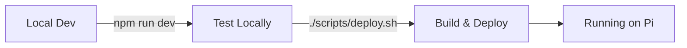

# Pi-Site

A self-hosted Next.js website running on a Raspberry Pi, featuring a dog photo gallery. This is my first self-hosted project, built to learn about self-hosting, Raspberry Pi management, and Cloudflare Tunnels.

## Project Overview

This project is a personal portfolio/gallery site that:

- Allows users to upload and view dog photos
- Uses SQLite database for metadata storage (Prisma ORM)
- Stores images on the filesystem
- Implements GitHub OAuth authentication via NextAuth.js
- Runs on a Raspberry Pi and is accessible via Cloudflare Tunnels

**Tech Stack:**

- Next.js 15
- React 19
- TypeScript
- Tailwind CSS
- ShadCN UI
- Prisma ORM
- SQLite
- Node.js

## TODO

- [ ] Migrate deployment to Coolify for automated Git-based deployments

## SSH Setup (run on dev machine)

```bash
ssh raspberrypi # Assuming ssh config and hostname are set up correctly on dev machine
```

## Development Workflow

### Quick Start



### Local Development

Just the regular Next.js dev flow:

```bash
npm run dev
```

Open [http://localhost:3000](http://localhost:3000) to see the result.

### Deploy to Raspberry Pi

Deploy with a single command from your development machine:

```bash
./scripts/deploy.sh
```

This builds the Docker image on your desktop, transfers it to your Raspberry Pi, and restarts the container automatically.

**First time setup:**

```bash
chmod +x scripts/deploy.sh
chmod +x scripts/build-and-transfer.sh
```

See [DOCKER.md](./DOCKER.md) for detailed Docker instructions.

### Server Management Scripts (on Raspberry Pi)

These scripts help manage the Docker container on your Raspberry Pi:

```bash
# Check container status
./scripts/check-server.sh

# Start container (if stopped)
./scripts/start-server.sh

# Stop container
./scripts/stop-server.sh

# Update code and optionally rebuild (usually use deploy.sh from desktop instead)
./scripts/update-server.sh
```

**Note:** The recommended workflow is to deploy from your desktop using `./scripts/deploy.sh`. These scripts are useful when you're already SSH'd into the Pi and need to manage the container directly.

## Architecture Notes

- **Database**: SQLite database (file-based, no server needed) using Prisma ORM for metadata storage
- **Image Storage**: Images stored on filesystem in `public/images/`
- **Authentication**: GitHub OAuth via NextAuth.js
- **Self-Hosted**: Runs on Raspberry Pi via Cloudflare Tunnels
- **Zero Setup**: SQLite requires no database server installation

## Database Setup

### Local Development

The database is automatically created when you run migrations:

```bash
npx prisma generate
npx prisma migrate dev
```

### Docker (Production on Raspberry Pi)

Database migrations run automatically during deployment. To run manually:

```bash
# On Raspberry Pi
docker compose exec app npx prisma migrate deploy
```

### Migrating Existing Data

If you have existing JSON metadata files in `public/meta/`, run the migration script once:

**Local:**

```bash
npx tsx scripts/migrate-to-db.ts
```

**Docker:**

```bash
docker compose exec app npx tsx scripts/migrate-to-db.ts
```

This will migrate all existing photo metadata from JSON files to the database. The script is idempotent and can be run multiple times safely.

### Database Management

**Local Development:**

- **View data**: `npx prisma studio` - Opens Prisma Studio to view/edit database
- **Create migration**: `npx prisma migrate dev --name migration_name`
- **Reset database**: `npx prisma migrate reset` (⚠️ deletes all data)

**Docker (Production):**

- **View data**: `docker compose exec app npx prisma studio` (then port forward if needed)
- **Run migrations**: `docker compose exec app npx prisma migrate deploy`
- **Test connection**: `docker compose exec app npx tsx scripts/test-db.ts`

The database file is located at `prisma/dev.db` and is automatically excluded from git. In Docker, it's persisted via volume mount.

## Docker

This project uses Docker for easy deployment. The recommended workflow is to build on your development machine and deploy to the Raspberry Pi.

**Quick Deploy:**

```bash
./scripts/deploy.sh  # One command to build, transfer, and restart
```

See [DOCKER.md](./DOCKER.md) for complete documentation.

**Benefits:**

- ✅ **One-command deployment** - build and deploy from your desktop
- ✅ **Consistent Node.js version** (22 LTS) - no version conflicts
- ✅ **Isolated environment** - no system-wide dependencies
- ✅ **Fast builds** - build on powerful desktop, run on Pi
- ✅ **Automatic migrations** - database migrations run automatically

## Links

- [Next.js Documentation](https://nextjs.org/docs)
- [Cloudflare Tunnels](https://developers.cloudflare.com/cloudflare-one/connections/connect-apps/)
- [Raspberry Pi Documentation](https://www.raspberrypi.com/documentation/)
- [Docker Documentation](https://docs.docker.com/)
