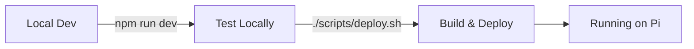

# Pi-Site

A self-hosted Next.js website running on a Raspberry Pi, featuring a dog photo gallery. This is my first self-hosted project, built to learn about self-hosting, Raspberry Pi management, and Cloudflare Tunnels.

## Project Overview

This project is a personal portfolio/gallery site that:

- Allows users to upload and view dog photos
- Uses SQLite database for metadata storage (Prisma ORM)
- Stores images on the filesystem
- Implements GitHub OAuth authentication via NextAuth.js
- Runs on a Raspberry Pi and is accessible via Cloudflare Tunnels

**Tech Stack:**

- Next.js 15
- React 19
- TypeScript
- Tailwind CSS
- ShadCN UI
- Prisma ORM
- SQLite
- Node.js 20+

## TODO

- [ ] Migrate deployment to Coolify for automated Git-based deployments

## SSH Setup (run on dev machine)

```bash
ssh raspberrypi # Assuming ssh config and hostname are set up correctly on dev machine
```

## Development Workflow

### Quick Start



### Local Development

**Requirements:**

- Node.js 20 or higher (use `nvm use` if you have nvm installed, or check with `node --version`)

Just the regular Next.js dev flow:

```bash
npm run dev
```

Open [http://localhost:3000](http://localhost:3000) to see the result.

### Deploy to Raspberry Pi

Deploy with a single command from your development machine:

```bash
./scripts/deploy.sh
```

This builds the app locally, syncs files to your Raspberry Pi, installs dependencies, and restarts the PM2 process automatically.

**First time setup:**

```bash
chmod +x scripts/deploy.sh
```

See [PM2_SETUP.md](./PM2_SETUP.md) for detailed deployment instructions.

### Server Management Scripts (on Raspberry Pi)

These scripts help manage the PM2 process on your Raspberry Pi:

```bash
# Check PM2 status
./scripts/check-server.sh

# Start app (if stopped)
./scripts/start-server.sh

# Stop app
./scripts/stop-server.sh

# Update code and optionally rebuild (usually use deploy.sh from desktop instead)
./scripts/update-server.sh
```

**Note:** The recommended workflow is to deploy from your desktop using `./scripts/deploy.sh`. These scripts are useful when you're already SSH'd into the Pi and need to manage the process directly.

## Architecture Notes

- **Database**: SQLite database (file-based, no server needed) using Prisma ORM for metadata storage
- **Image Storage**: Images stored on filesystem in `public/images/`
- **Authentication**: GitHub OAuth via NextAuth.js
- **Self-Hosted**: Runs on Raspberry Pi via Cloudflare Tunnels
- **Zero Setup**: SQLite requires no database server installation

## Database Setup

### Local Development

The database is automatically created when you run migrations:

```bash
npx prisma generate
npx prisma migrate dev
```

### Production (Raspberry Pi)

Database migrations run automatically during deployment. To run manually:

```bash
# On Raspberry Pi
cd ~/pi-site
npx prisma migrate deploy
```

### Migrating Existing Data

If you have existing JSON metadata files in `public/meta/`, run the migration script once:

**Local:**

```bash
npx tsx scripts/migrate-to-db.ts
```

**Production (Raspberry Pi):**

```bash
cd ~/pi-site
npx tsx scripts/migrate-to-db.ts
```

This will migrate all existing photo metadata from JSON files to the database. The script is idempotent and can be run multiple times safely.

### Database Management

**Local Development:**

- **View data**: `npx prisma studio` - Opens Prisma Studio to view/edit database
- **Create migration**: `npx prisma migrate dev --name migration_name`
- **Reset database**: `npx prisma migrate reset` (⚠️ deletes all data)

**Production (Raspberry Pi):**

- **View data**: `npx prisma studio` (then port forward via SSH if needed)
- **Run migrations**: `npx prisma migrate deploy`
- **Test connection**: `npx tsx scripts/test-db.ts`

The database file is located at `prisma/dev.db` and is automatically excluded from git.

## Deployment

This project uses PM2 for process management on the Raspberry Pi. There are two deployment methods:

### Automatic Deployment (Main Branch)

When you push to the `main` branch, GitHub Actions automatically deploys to the Raspberry Pi using a **self-hosted runner**. This is the recommended workflow for production deployments.

**Why self-hosted runner?**

- No router configuration needed - the Pi connects to GitHub (outbound connection)
- No need to expose SSH or open ports
- More secure - no inbound connections required
- Runs directly on your Pi, so it has access to all local resources

**Setup (One-time):**

1. Install the GitHub Actions runner on your Raspberry Pi:

   ```bash
   # SSH into your Pi
   ssh raspberrypi

   # Create a directory for the runner
   mkdir -p ~/actions-runner && cd ~/actions-runner

   # Download the latest runner package (ARM64 for Raspberry Pi)
   curl -o actions-runner-linux-arm64-2.311.0.tar.gz -L https://github.com/actions/runner/releases/download/v2.311.0/actions-runner-linux-arm64-2.311.0.tar.gz

   # Extract the installer
   tar xzf ./actions-runner-linux-arm64-2.311.0.tar.gz
   ```

2. Configure the runner:

   ```bash
   # Get your repository URL and token from GitHub:
   # Go to: Settings → Actions → Runners → New self-hosted runner
   # Copy the registration token and run:
   ./config.sh --url https://github.com/YOUR_USERNAME/YOUR_REPO --token YOUR_TOKEN

   # When prompted:
   # - Runner name: pi-site-runner (or any name)
   # - Labels: leave default or add "raspberry-pi"
   # - Work folder: ~/actions-runner/_work (default is fine)
   ```

3. Install and start the runner as a service:

   ```bash
   # Install the service
   sudo ./svc.sh install

   # Start the service
   sudo ./svc.sh start

   # Check status
   sudo ./svc.sh status
   ```

4. Verify the runner appears in GitHub:
   - Go to your repository → Settings → Actions → Runners
   - You should see your self-hosted runner listed as "Idle"

**How it works:**

- Push to `main` branch → GitHub Actions triggers
- GitHub sends the job to your self-hosted runner (Pi connects to GitHub, not the other way around)
- Runner checks out code, builds, and deploys directly on the Pi
- App automatically restarts with new code

**Troubleshooting:**

- View runner logs: `~/actions-runner/_diag/Runner_*.log`
- Restart runner service: `sudo ./svc.sh restart` (from `~/actions-runner`)
- Stop runner: `sudo ./svc.sh stop`
- Remove runner: `./config.sh remove --token YOUR_TOKEN` (get new token from GitHub)

### Manual Deployment (Feature Branches)

For feature branches or when you need manual control, use the deploy script:

```bash
./scripts/deploy.sh  # One command to build, sync, and restart
```

This script:

- Builds the app locally first (fail fast)
- Commits and pushes your current branch to GitHub
- SSHs to Pi and pulls the latest code
- Installs dependencies, builds, and restarts PM2

See [PM2_SETUP.md](./PM2_SETUP.md) for complete deployment documentation.

**Benefits:**

- ✅ **Automatic deployments** - main branch deploys automatically via GitHub Actions
- ✅ **Manual control** - feature branches can be deployed manually
- ✅ **One-command deployment** - build and deploy from your desktop
- ✅ **Simple setup** - no Docker complexity, direct Node.js execution
- ✅ **Fast deployments** - sync files and restart, no image building
- ✅ **Easy debugging** - direct access to logs and process management
- ✅ **Automatic migrations** - database migrations run automatically

## Links

- [Next.js Documentation](https://nextjs.org/docs)
- [Cloudflare Tunnels](https://developers.cloudflare.com/cloudflare-one/connections/connect-apps/)
- [Raspberry Pi Documentation](https://www.raspberrypi.com/documentation/)
- [PM2 Documentation](https://pm2.keymetrics.io/docs/usage/quick-start/)
